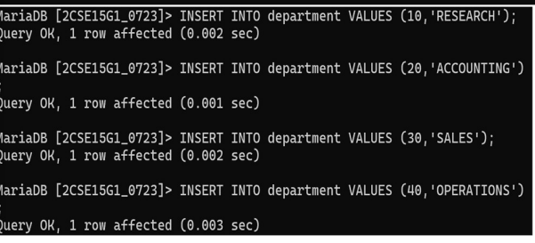
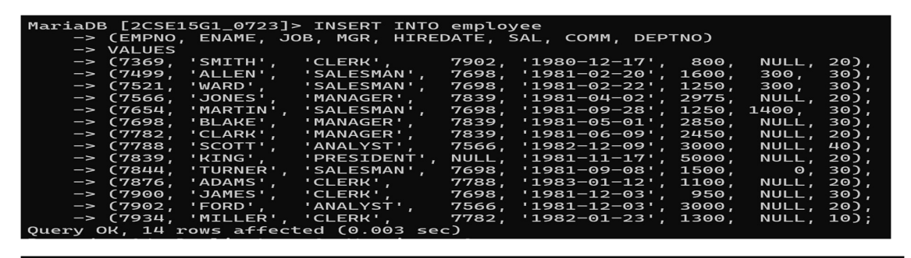

***Aim***

**To create EMPLOYEE and DEPARTMENT tables and insert records using MySQL commands.**

---

## ***Theory***

A **database** is an organized collection of data stored in tables. **MySQL** is a relational database management system used to create and manage such data.

* The `CREATE TABLE` command defines the structure of a table.
* The `INSERT INTO` command is used to add records.
* A **Primary Key** uniquely identifies each record.
* A **Foreign Key** establishes a relationship between two tables.

---

## ***Table Structure***

### **1. EMPLOYEE Table**

| **Column Name** | **Data Type** | **Size** | **Constraints** |
| --------------- | ------------- | -------- | --------------- |
| EMPNO           | INT           | 4        | Primary Key     |
| ENAME           | VARCHAR       | 20       | NOT NULL        |
| JOB             | VARCHAR       | 20       | —               |
| MGR             | INT           | 4        | —               |
| HIREDATE        | DATE          | —        | —               |
| SAL             | INT           | 10       | —               |
| COMM            | INT           | 7        | —               |
| DEPTNO          | INT           | 2        | Foreign Key     |

---

### **2. DEPARTMENT Table**

| **Column Name** | **Data Type** | **Size** | **Constraints** |
| --------------- | ------------- | -------- | --------------- |
| DEPTNO          | INT           | 2        | Primary Key     |
| DNAME           | VARCHAR       | 15       | NOT NULL        |

---

## ***Commands / Procedure***

---

### **Q1. *Create a database named 2CSE15G1_0723***

```sql
CREATE DATABASE 2CSE15G1_0723;
USE 2CSE15G1_0723;
```

---

### **Q2. *Create DEPARTMENT table with specified constraints***

```sql
CREATE TABLE DEPARTMENT (
    DEPTNO INT(2) PRIMARY KEY,
    DNAME VARCHAR(15) NOT NULL
);
```

---

### **Q3. *Create EMPLOYEE table with specified constraints***

```sql
CREATE TABLE EMPLOYEE (
    EMPNO INT(4) PRIMARY KEY,
    ENAME VARCHAR(20) NOT NULL,
    JOB VARCHAR(20),
    MGR INT(4),
    HIREDATE DATE,
    SAL INT(10),
    COMM INT(7),
    DEPTNO INT(2),
    FOREIGN KEY (DEPTNO) REFERENCES DEPARTMENT(DEPTNO)
);
```

---

### **Q4. *Insert records into DEPARTMENT table***

```sql
INSERT INTO DEPARTMENT VALUES (10, 'RESEARCH');
INSERT INTO DEPARTMENT VALUES (20, 'ACCOUNTING');
INSERT INTO DEPARTMENT VALUES (30, 'SALES');
INSERT INTO DEPARTMENT VALUES (40, 'OPERATIONS');
```

---

### **Q5. *Insert records into EMPLOYEE table***

```sql
INSERT INTO EMPLOYEE VALUES (7369, 'SMITH', 'CLERK', 7902, '1980-12-17', 800, NULL, 20);
INSERT INTO EMPLOYEE VALUES (7499, 'ALLEN', 'SALESMAN', 7698, '1981-02-20', 1600, 300, 30);
INSERT INTO EMPLOYEE VALUES (7521, 'WARD', 'SALESMAN', 7698, '1981-02-22', 1250, 500, 30);
INSERT INTO EMPLOYEE VALUES (7566, 'JONES', 'MANAGER', 7839, '1981-04-02', 2975, NULL, 20);
INSERT INTO EMPLOYEE VALUES (7654, 'MARTIN', 'SALESMAN', 7698, '1981-09-28', 1250, 1400, 30);
INSERT INTO EMPLOYEE VALUES (7698, 'BLAKE', 'MANAGER', 7839, '1981-05-01', 2850, NULL, 30);
INSERT INTO EMPLOYEE VALUES (7782, 'CLARK', 'MANAGER', 7839, '1981-06-09', 2450, NULL, 20);
INSERT INTO EMPLOYEE VALUES (7788, 'SCOTT', 'ANALYST', 7566, '1982-12-09', 3000, NULL, 40);
INSERT INTO EMPLOYEE VALUES (7839, 'KING', 'PRESIDENT', NULL, '1981-11-17', 5000, NULL, 20);
INSERT INTO EMPLOYEE VALUES (7844, 'TURNER', 'SALESMAN', 7698, '1981-09-08', 1500, 0, 30);
INSERT INTO EMPLOYEE VALUES (7876, 'ADAMS', 'CLERK', 7788, '1983-01-12', 1100, NULL, 20);
INSERT INTO EMPLOYEE VALUES (7900, 'JAMES', 'CLERK', 7698, '1981-12-03', 950, NULL, 30);
INSERT INTO EMPLOYEE VALUES (7902, 'FORD', 'ANALYST', 7566, '1981-12-03', 3000, NULL, 20);
INSERT INTO EMPLOYEE VALUES (7934, 'MILLER', 'CLERK', 7782, '1982-01-23', 1300, NULL, 10);
```

---

## ***Conclusion***

The EMPLOYEE and DEPARTMENT tables were successfully created and populated with data using MySQL commands.

---

